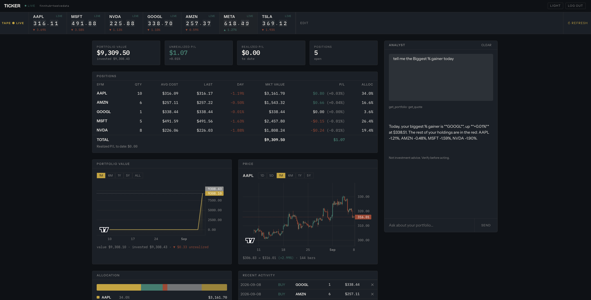

```{python}
#| label: setup

import numpy as np
import pandas as pd
import plotly.graph_objects as go
import plotly.io as pio
from IPython.display import HTML, display

# Design tokens, taken verbatim from the live app's stylesheet so the deck
# and the product read as one system.
PAPER = "#0e1116"
INK   = "#f5f2ec"
SLATE = "#1a2028"
GAIN  = "#2f7d6e"
LOSS  = "#a8442f"
BRASS = "#c9a227"
MUTED = "#8b929c"
GRID  = "#232a33"

# ---------------------------------------------------------------------------
# EVIDENCE.  Every number below is measured from the Ticker repository or
# quoted from its own planning documents. Nothing here is invented.
#
#   git log            21 commits, 2026-08-10 .. 2026-09-06, 5 working days
#   plan.md   Sec.10   per-phase estimates, written before any code existed
#   prompts.md         "The plan is 8-12 days of work"
#   cloc-equivalent    line counts by extension, node_modules excluded
# ---------------------------------------------------------------------------

# plan.md Sec.10 build order: (phase, low, high) in developer-days.
PHASES = [
    ("Phase 0 · skeleton",        0.5, 0.5),
    ("Phase 1 · data in",         1.0, 1.0),
    ("Phase 2 · live prices",     1.0, 2.0),
    ("Phase 3 · portfolio",       2.0, 2.0),
    ("Phase 4 · charts",          1.0, 1.0),
    ("Phase 5 · chat",            2.0, 3.0),
    ("Phase 6 · polish & harden", 1.0, 2.0),
]
PLAN_LO  = sum(p[1] for p in PHASES)          # 8.5 days
PLAN_HI  = sum(p[2] for p in PHASES)          # 11.5 days
PLAN_MID = (PLAN_LO + PLAN_HI) / 2            # 10.0 days

# Reconstructed from commit timestamps. Two methods, both shown:
#   lower bound  gaps between consecutive commits, capped at 45 min, plus
#                30 min lead-in for each of the 4 working sessions
#   upper bound  first-to-last commit span on each working day
ACTUAL_LO_H, ACTUAL_HI_H = 9.2, 16.2
HOURS_PER_DAY = 8.0
ACTUAL_LO = ACTUAL_LO_H / HOURS_PER_DAY       # 1.15 days
ACTUAL_HI = ACTUAL_HI_H / HOURS_PER_DAY       # 2.03 days
ACTUAL_MID = (ACTUAL_LO + ACTUAL_HI) / 2      # 1.59 days

SPEEDUP_LO = PLAN_LO / ACTUAL_HI              # most conservative
SPEEDUP_HI = PLAN_HI / ACTUAL_LO              # most generous
SPEEDUP_MID = PLAN_MID / ACTUAL_MID
REDUCTION = 1 - ACTUAL_MID / PLAN_MID

pio.templates["ticker"] = go.layout.Template(
    layout=dict(
        paper_bgcolor="rgba(0,0,0,0)",
        plot_bgcolor="rgba(0,0,0,0)",
        font=dict(family="Instrument Sans, ui-sans-serif, system-ui", color=INK, size=15),
        colorway=[BRASS, GAIN, LOSS, MUTED],
        xaxis=dict(gridcolor=GRID, zerolinecolor=GRID, linecolor=GRID,
                   tickfont=dict(family="IBM Plex Mono, monospace", size=13, color=MUTED)),
        yaxis=dict(gridcolor=GRID, zerolinecolor=GRID, linecolor=GRID,
                   tickfont=dict(family="IBM Plex Mono, monospace", size=13, color=MUTED)),
        legend=dict(bgcolor="rgba(0,0,0,0)", font=dict(size=13, color=MUTED),
                    orientation="h", yanchor="top", y=-0.14, x=0),
        margin=dict(l=64, r=28, t=60, b=76),
        hoverlabel=dict(bgcolor=SLATE, bordercolor=BRASS,
                        font=dict(family="IBM Plex Mono, monospace", size=13, color=INK)),
    )
)
pio.templates.default = "ticker"
rng = np.random.default_rng(20260907)
CONFIG = {"displayModeBar": False, "responsive": True}

def show(fig):
    """Emit a chart as plain HTML; plotly.js is loaded once from <head>."""
    height = fig.layout.height or 500
    display(HTML(pio.to_html(
        fig, include_plotlyjs=False, full_html=False, config=CONFIG,
        default_width="100%", default_height=f"{height}px")))

def menu_style(**kw):
    base = dict(
        type="buttons", direction="right",
        bgcolor=SLATE, bordercolor=GRID, borderwidth=1,
        font=dict(family="IBM Plex Mono, monospace", size=12, color=INK),
        pad=dict(r=6, t=6), showactive=True, active=0,
        x=0, xanchor="left", y=1.20, yanchor="top",
    )
    base.update(kw)
    return base
```

##  {#title .center}

::: {style="max-width:27em"}
[A case study in AI-assisted development · September 2026]{.kicker}

::: {style="font-family:'Bricolage Grotesque',sans-serif;font-weight:700;font-size:4.4em;line-height:0.95;letter-spacing:-0.04em;margin:0.1em 0 0 0"}
Ticker
:::

::: {.title-lead}
A live stock dashboard with a streaming price feed, a FIFO portfolio ledger,
and an AI analyst that can propose changes but never make them.

**Specified, built, tested and deployed in about two working days.**
:::

::: {style="margin-top:1.2em;font-family:'IBM Plex Mono',monospace;font-size:0.4em;letter-spacing:0.14em;text-transform:uppercase;color:#8b929c"}
AAPL [319.97]{data-tick="319.97" style="color:#2f7d6e"} &nbsp;·&nbsp;
MSFT [499.70]{data-tick="499.70" style="color:#2f7d6e"} &nbsp;·&nbsp;
NVDA [230.36]{data-tick="230.36" style="color:#a8442f"} &nbsp;·&nbsp;
ticker-dash.fly.dev
:::
:::

::: {.notes}
<span style="color:#c1121f;font-weight:700">[TARGET TIME: 0:50 — TOTAL 0:50]</span>

Good morning, everyone. Thanks for making the time.

I want to start with a question, and I'd genuinely like you to think about your answer before I give you mine.

<span style="color:#c1121f;font-weight:700">[PAUSE — LET THIS LAND BEFORE CONTINUING]</span>

How much working software can one person build in two days?

Not a prototype. Not a demo that falls over when you click the wrong thing. I mean a real application. Live data, a database, a proper front end, tests, deployed to the internet, running right now.

<span style="color:#c1121f;font-weight:700">[PAUSE — 2 SECONDS]</span>

A year ago my honest answer would have been: not much. Maybe a rough prototype.

So I ran the experiment on myself. This is Ticker. It's a live stock dashboard with an AI analyst built into it. I specified it, built it, tested it, and deployed it — and the whole thing took about two working days.

Over the next fifteen minutes I want to show you what it does, and then I want to be really specific about how it got built. Because the interesting part isn't the app. The interesting part is what the process says about how software gets made now.
:::

## The question I actually wanted to answer {.center}

::: {.split}
::: {}
::: {.pull}
Where does the time go when an AI agent writes most of the code?
:::

::: {style="font-size:0.5em;line-height:1.6;color:#8b929c;margin-top:0.9em"}
There is a comfortable story that says AI writes the code and the job is
finished. There is an equally comfortable story that says none of it works and
you rewrite it all anyway.

**Neither matched what I saw.** So I kept the receipts: a spec written before
any code, a decision log, one commit per phase, and every defect recorded
where it surfaced.
:::

::: {style="margin-top:1em;font-size:0.44em;color:#8b929c"}
Everything in this talk is measured from that repository.
:::
:::

::: {}
::: {.card}
[The claim]{.tag}[AI is an accelerator, not an author]{.h4}

It compressed the work. It did not remove the engineering.

Direction, architecture, verification and the decision to ship stayed with me — and that is exactly where the remaining time went.
:::
:::
:::

::: {.notes}
<span style="color:#c1121f;font-weight:700">[TARGET TIME: 0:45 — TOTAL 1:35]</span>

So here's the question I actually set out to answer.

When you hand most of the typing to an AI agent, where does the time go? What disappears, and what stubbornly doesn't?

There are two easy stories people tell about this. One is that AI writes your code now and engineering is basically over. The other is that everything it produces is garbage and you throw it away and do it properly.

<span style="color:#c1121f;font-weight:700">[SLOW DOWN HERE]</span>

Neither of those matched what I actually experienced. The truth was more interesting, and honestly more useful.

So I treated the project like an experiment. I kept the receipts. I wrote the specification before any code existed. I kept a decision log. I committed one phase at a time, so the history is readable. And I recorded every bug by where it surfaced.

That means everything I'm about to tell you — every number, every time estimate — comes out of that repository. I'm not going to give you a vibe. I'm going to show you the evidence.

Here's the claim I'll be defending: AI acted as an accelerator, not an author. It compressed the work dramatically. It did not remove the engineering. And the parts that didn't compress turn out to be the interesting parts.

Let me show you what got built.
:::

## What I built

[One process · one machine · three rented services]{.kicker}

::: {.stat-grid .cols-4}
::: {.stat}
[Backend]{.label}[[7,963]{.value .num}]{.value}[lines of Python · FastAPI · 14 REST routes, a WebSocket and an SSE stream]{.note}
:::
::: {.stat}
[Frontend]{.label}[[3,033]{.value .num}]{.value}[lines of TypeScript · React 18, Zustand, TanStack Query]{.note}
:::
::: {.stat}
[Tests]{.label}[[291]{.value .num}]{.value}[passing · 241 test functions across 15 files]{.note}
:::
::: {.stat}
[Running cost]{.label}[[~$3]{.value .num}]{.value}[per month, all in · one always-on machine]{.note}
:::
:::

::: {.cols style="margin-top:0.9em"}
::: {.card}
[Live]{.tag}[Streaming prices]{.h4}

A single upstream socket, coalesced to at most four updates per second per symbol, fanned out to every open browser.
:::
::: {.card}
[Correct]{.tag}[A real FIFO ledger]{.h4}

Positions, cost basis and realised P/L are recomputed from an append-only transaction log. No stored share count.
:::
::: {.card}
[Safe]{.tag}[An analyst that cannot trade]{.h4}

The model reads your holdings and the web, and proposes changes. Nothing is written until you press Confirm.
:::
:::

::: {.notes}
<span style="color:#c1121f;font-weight:700">[TARGET TIME: 0:45 — TOTAL 2:20]</span>

This is what came out the other end.

Roughly eight thousand lines of Python on the back end, three thousand lines of TypeScript on the front end, and two hundred and ninety-one passing tests. It runs on one machine and costs about three dollars a month.

<span style="color:#c1121f;font-weight:700">[POINT AT THE THREE CARDS ALONG THE BOTTOM]</span>

And it does three genuinely non-trivial things.

It streams live prices. There's one connection to the market, and it fans out to every browser that's open.

It keeps a real portfolio ledger. And I mean real — first-in-first-out lot accounting, the same method your broker uses for tax reporting. Your positions and your profit and loss are recalculated from the transaction history every single time.

And it has an AI analyst built in that can read your holdings and search the web, and can suggest a change to your portfolio — but physically cannot make that change. It can only propose. You have to confirm.

<span style="color:#c1121f;font-weight:700">[PAUSE]</span>

Rather than talk about it, let me just show you the thing running.
:::

##  {#live-demo background-iframe="https://ticker-dash.fly.dev/" background-interactive="true"}

[Live · ticker-dash.fly.dev]{.demo-badge}

::: {.demo-overlay}
[If the frame is blank, the session cookie was blocked]{.hint}
[Open live demo ↗](https://ticker-dash.fly.dev/){target="_blank" rel="noopener"}
:::

::: {.notes}
<span style="color:#c1121f;font-weight:700">[TARGET TIME: 2:00 — TOTAL 4:20]</span>

<span style="color:#c1121f;font-weight:700">[BEFORE THE TALK: LOG IN TO ticker-dash.fly.dev IN ANOTHER TAB OF THIS SAME BROWSER. IF THE FRAME SHOWS THE PASSPHRASE GATE, CLICK THE GOLD "OPEN LIVE DEMO" BUTTON, BOTTOM RIGHT, AND DEMO IN A REAL TAB.]</span>

So this is the actual application. This is not a screenshot — this is running on a server in New Jersey right now.

<span style="color:#c1121f;font-weight:700">[POINT AT THE TICKER TAPE ACROSS THE TOP — DO NOT CLICK YET]</span>

Across the top is the ticker tape. When the market is open, those digits flip as trades come in. Each symbol updates independently — one price change repaints one row, not the whole table. That sounds like a small detail. It's actually the hardest engineering problem in the app, and I'll come back to it in a minute.

<span style="color:#c1121f;font-weight:700">[SCROLL DOWN TO THE POSITIONS TABLE]</span>

Down here is the portfolio. Cost basis, unrealised profit and loss, allocation.

<span style="color:#c1121f;font-weight:700">[POINT AT ANY VALUE SHOWING AN EM DASH, OR AT "MARKET CLOSED" IF OUT OF HOURS]</span>

And notice this — where a price isn't available, it shows a dash. Not a zero. That's deliberate. A zero looks like a real number and quietly lies to you. This was a rule I wrote into the spec before any code existed, and I'll show you that document shortly.

<span style="color:#c1121f;font-weight:700">[CLICK INTO THE ANALYST PANEL ON THE RIGHT. TYPE: "How is my portfolio doing?" AND SEND.]</span>

Now, the analyst. I'll ask it something about the portfolio.

<span style="color:#c1121f;font-weight:700">[WAIT FOR THE RESPONSE TO STREAM IN — ABOUT 5 SECONDS. DO NOT TALK OVER IT.]</span>

It's reading my actual holdings to answer that — it's calling into the same code the rest of the dashboard uses.

<span style="color:#c1121f;font-weight:700">[NOW TYPE: "Add 10 shares of NVDA" AND SEND. WAIT FOR THE CONFIRM CARD TO APPEAR.]</span>

Here's the part I want you to see. I'm going to ask it to change my portfolio.

<span style="color:#c1121f;font-weight:700">[POINT AT THE CONFIRM CARD. DO NOT CLICK CONFIRM.]</span>

It didn't do it. It produced a proposal, and it's waiting for me.

And this isn't the model being polite. The code that handles those tool calls is handed a read-only object. It has no database connection at all. It cannot write, because it isn't holding anything capable of writing.

<span style="color:#c1121f;font-weight:700">[CLICK DISMISS. THEN RETURN TO THE SLIDES.]</span>

I'll decline that one.

That's the product. Now — the actual subject of this talk. How long should something like that take to build?
:::

## The part that was genuinely hard {.center}

[The engineering problem at the centre of the app]{.kicker}

```{python}
#| label: rate-mismatch

DURATION, TRADES_SEC = 3.0, 300
N = int(DURATION * TRADES_SEC)
t = np.sort(rng.uniform(0, DURATION, N))
price = 187.40 + np.cumsum(rng.normal(0, 0.006, N))

def coalesce(interval_ms):
    """PriceHub.flush(): latest price per symbol, at most once per interval."""
    step = interval_ms / 1000.0
    xs, ys = [], []
    for e in np.arange(step, DURATION + step, step):
        taken = price[t <= e]
        if len(taken):
            xs.append(e); ys.append(taken[-1])
    return xs, ys

x250, y250 = coalesce(250)

def note(ms, n_out):
    return [dict(
        x=0.02, y=0.97, xref="paper", yref="paper",
        xanchor="left", yanchor="top", showarrow=False, align="left",
        font=dict(family="IBM Plex Mono, monospace", size=17, color=INK),
        bgcolor="rgba(26,32,40,0.85)", bordercolor=BRASS, borderwidth=1, borderpad=9,
        text=(f"<b>{N} prints in</b>  →  <b style='color:{BRASS}'>{n_out} frames out</b>"
              f"<br><span style='font-size:13px;color:{MUTED}'>"
              f"flush every {ms} ms · {N/max(n_out,1):.0f}× reduction</span>"))]

fig = go.Figure()
fig.add_trace(go.Scatter(
    x=t, y=price, mode="markers", name=f"trades arriving · {TRADES_SEC}/s",
    marker=dict(size=3.4, color=MUTED, opacity=0.5),
    hovertemplate="trade<br>%{x:.3f}s · $%{y:.2f}<extra></extra>"))
fig.add_trace(go.Scatter(
    x=x250, y=y250, mode="lines+markers", name="what the browser receives",
    line=dict(color=BRASS, width=2.5, shape="hv"),
    marker=dict(size=9, color=BRASS, line=dict(color=PAPER, width=2)),
    hovertemplate="flush<br>%{x:.3f}s · $%{y:.2f}<extra></extra>"))

buttons = []
for ms in (100, 250, 1000):
    xs, ys = coalesce(ms)
    buttons.append(dict(label=f"  {ms} ms  ", method="update",
        args=[{"x": [t, xs], "y": [price, ys]}, {"annotations": note(ms, len(xs))}]))

fig.update_layout(
    height=470, autosize=True, annotations=note(250, len(x250)),
    xaxis=dict(title="seconds", range=[0, DURATION]),
    yaxis=dict(title="price", tickprefix="$"),
    updatemenus=[menu_style(buttons=buttons, active=1)],
    hovermode="closest")
show(fig)
```

[Illustrative of the ratio described in the spec, not a recording of real trades. **This is the kind of problem no amount of code generation solves for you** — you have to know it exists.]{.caption}

::: {.notes}
<span style="color:#c1121f;font-weight:700">[TARGET TIME: 1:15 — TOTAL 5:35]</span>

I want to spend a minute on this, because it's the thing that makes the difference between a demo and an application.

A liquid stock like Apple prints hundreds of individual trades every second. The grey cloud you're looking at is three seconds of that. About nine hundred price updates.

A browser cannot redraw nine hundred times in three seconds. If you just pipe that feed straight through, the tab locks up. The page becomes unusable.

<span style="color:#c1121f;font-weight:700">[POINT AT THE GOLD STAIRCASE LINE]</span>

The gold line is what the browser actually receives. The server keeps the newest price for each symbol in memory, and flushes at most once every two hundred and fifty milliseconds. Nine hundred updates in, twelve out.

<span style="color:#c1121f;font-weight:700">[CLICK THE "100 ms" BUTTON]</span>

I can change that window. At a hundred milliseconds it tracks the market more closely — but you've quadrupled the traffic to every connected browser.

<span style="color:#c1121f;font-weight:700">[CLICK THE "1000 ms" BUTTON]</span>

At one second it's cheap, but look — you can see it lagging behind the real price. It feels sluggish.

<span style="color:#c1121f;font-weight:700">[CLICK BACK TO "250 ms"]</span>

Two hundred and fifty milliseconds is the compromise I shipped.

<span style="color:#c1121f;font-weight:700">[EMPHASIZE THIS NEXT LINE]</span>

Now — here's why this slide is in the talk. No AI model was going to tell me this problem existed. I had to know that a real market feed will drown a browser, decide that coalescing was the answer, and pick the number. I wrote that requirement into the specification before any code was generated.

The agent implemented it well, and quickly. But the problem, and the choice, were mine.

So that's the app, and that's the hardest part of it. Let's talk about what building it would normally involve.
:::

## Under the hood

[Five layers, one process, three rented services]{.kicker}

```{mermaid}
%%{init: {'theme':'base',
  'fontFamily':'Instrument Sans, ui-sans-serif, system-ui, sans-serif',
  'flowchart':{'htmlLabels':true,'useMaxWidth':true,'curve':'basis','nodeSpacing':26,'rankSpacing':58},
  'themeVariables':{
  'background':'#0e1116','primaryColor':'#1a2028','primaryTextColor':'#f5f2ec',
  'primaryBorderColor':'#232a33','lineColor':'#5c6672','fontSize':'14px',
  'edgeLabelBackground':'#0e1116'}}}%%
flowchart LR
  FS["Finnhub socket<br/>trades"]
  FQ["Finnhub REST<br/>quotes · search"]
  TD["Twelve Data<br/>daily bars"]
  AN["Anthropic<br/>Messages API"]
  CP["CompositeProvider<br/>routes by capability"]
  CA["CachingProvider<br/>quotes 5s · candles 60s"]
  PH["PriceHub<br/>coalesce 250 ms"]
  LE["Lot engine<br/>FIFO · realised P/L"]
  PF["Performance<br/>value over time"]
  CS["ChatService<br/>propose only"]
  WS["/ws/prices"]
  RE["/api/* REST"]
  SS["/api/chat/stream"]
  ZS["Zustand store<br/>keyed by symbol"]
  TQ["TanStack Query"]
  DB[("SQLite WAL<br/>Fly volume")]

  FS --> PH --> WS --> ZS
  FQ --> CP
  TD --> CP
  CP --> CA --> LE
  CA --> PF
  LE --> RE
  PF --> RE
  RE --> TQ
  AN --> CS --> SS --> TQ
  LE <--> DB
  PF --> DB
  CS -. "reads only" .-> LE

  classDef rented fill:#151a21,stroke:#3a424c,color:#8b929c
  classDef ours   fill:#1a2028,stroke:#39424e,color:#f5f2ec
  classDef store  fill:#14201c,stroke:#2f7d6e,color:#f5f2ec
  class FS,FQ,TD,AN rented
  class CP,CA,PH,LE,PF,CS,WS,RE,SS,ZS,TQ ours
  class DB store
```

[Grey is rented, slate is mine, green is the disk. **The layering was decided before any code was written** — that decision is why swapping a failed data provider later cost one file.]{.caption}

::: {.notes}
<span style="color:#c1121f;font-weight:700">[TARGET TIME: 0:40 — TOTAL 6:15]</span>

<span style="color:#c1121f;font-weight:700">[DO NOT SPEND MORE THAN 40 SECONDS ON THIS DIAGRAM. DO NOT READ THE BOXES OUT.]</span>

Very quickly, so you can see it's a real system and not a toy.

Grey boxes on the left are services I rent. Everything in the middle is mine. The green cylinder is the database.

<span style="color:#c1121f;font-weight:700">[TRACE THE BOTTOM ROW WITH THE CURSOR, LEFT TO RIGHT]</span>

The bottom row is the live price path — socket, coalescing, WebSocket, browser.

The one thing I'd point out is that provider layer near the left. I put an interface there before I wrote any provider code. That turned out to matter, and I'll tell you why in a moment.

So: that's what got built. Now the real question — what would this normally take?
:::

## What this normally takes

[Developer-days by discipline — from the project's own spec]{.kicker}

```{python}
#| label: skills

# plan.md Sec.10 gives an estimate per phase. Mapping each phase to the
# discipline that would own it in a conventional team gives the shape of the
# work. Midpoints used where the spec gave a range.
DISCIPLINES = [
    ("Backend · APIs, services, realtime", 3.25, "Backend engineer"),
    ("Frontend · React, state, UI",        2.25, "Frontend engineer"),
    ("Data · schema, FIFO ledger, SQL",    1.50, "Data / backend"),
    ("AI integration · tools, streaming",  1.25, "Backend engineer"),
    ("Design & UX · the Sec.8.2 pass",     0.75, "Designer"),
    ("DevOps · Docker, Fly, CI/CD",        0.50, "Platform engineer"),
    ("Testing · 291 tests",                0.50, "Whoever is left"),
]
ROLE_COLOUR = {
    "Backend engineer": BRASS, "Frontend engineer": GAIN,
    "Data / backend": "#7a8794", "Designer": LOSS,
    "Platform engineer": "#5c6672", "Whoever is left": "#3f4854",
}
labels = [d[0] for d in DISCIPLINES]
days   = [d[1] for d in DISCIPLINES]
roles  = [d[2] for d in DISCIPLINES]

fig = go.Figure(go.Bar(
    x=days, y=labels, orientation="h",
    marker=dict(color=[ROLE_COLOUR[r] for r in roles],
                line=dict(color=PAPER, width=1)),
    customdata=roles,
    hovertemplate="<b>%{y}</b><br>%{customdata}<br>%{x} developer-days<extra></extra>",
    text=[f"  {d}d" for d in days], textposition="outside", cliponaxis=False,
    textfont=dict(family="IBM Plex Mono, monospace", size=14, color=INK)))

fig.add_annotation(
    x=0.99, y=0.10, xref="paper", yref="paper", xanchor="right", showarrow=False,
    align="right", font=dict(family="IBM Plex Mono, monospace", size=16, color=INK),
    bgcolor="rgba(26,32,40,0.9)", bordercolor=BRASS, borderwidth=1, borderpad=10,
    text=(f"<b>{PLAN_LO:.1f} – {PLAN_HI:.1f} developer-days</b>"
          f"<br><span style='font-size:13px;color:{MUTED}'>"
          f"across 5–6 specialisms · estimated in plan.md §10<br>"
          f"before a line of code existed</span>"))

fig.update_layout(
    height=430, autosize=True, bargap=0.38, showlegend=False,
    xaxis=dict(title="developer-days", range=[0, 4.2]),
    yaxis=dict(autorange="reversed",
               tickfont=dict(family="Instrument Sans", size=14, color=INK)),
    margin=dict(l=330, r=80, t=20, b=52))
show(fig)
```

::: {.notes}
<span style="color:#c1121f;font-weight:700">[TARGET TIME: 1:05 — TOTAL 7:20]</span>

Here's where the numbers start, and I want to be precise about where they come from.

Before I wrote any code, I wrote a specification. In it I broke the work into seven phases and I estimated each one. That estimate is timestamped in the repository, and critically — I made it before I knew how long it would actually take. So it's not a number I reverse-engineered to make myself look good.

<span style="color:#c1121f;font-weight:700">[POINT AT THE BOX IN THE BOTTOM RIGHT]</span>

Added up, the spec says eight and a half to eleven and a half developer-days.

What this chart does is take those same estimates and group them by the discipline that would normally own the work.

<span style="color:#c1121f;font-weight:700">[RUN THE CURSOR DOWN THE BARS AS YOU LIST THEM]</span>

Back end — APIs, services, the real-time layer. Front end — React, state management, the interface. Data — the database schema and the FIFO ledger. AI integration. Design. DevOps. Testing.

<span style="color:#c1121f;font-weight:700">[SLOW DOWN HERE]</span>

Now look at that list as a staffing question. In most organisations that isn't one person. That's a back-end engineer, a front-end engineer, someone comfortable with data modelling, a designer, and somebody who owns deployment. Five or six specialisms.

And that's the honest baseline. Two working weeks of effort, spread across a small team.

So — what actually happened?
:::

## It started with a spec, not a prompt

::: {.split}
::: {}
::: {.stat-grid .cols-3}
::: {.stat}
[plan.md]{.label}[[606]{.value .num}]{.value}[lines · §1–§14. Architecture, data model, API surface, the design system, deployment, and the build order.]{.note}
:::
::: {.stat}
[CLAUDE.md]{.label}[[342]{.value .num}]{.value}[lines · the decisions I did not want re-litigated in session nine.]{.note}
:::
::: {.stat}
[prompts.md]{.label}[[116]{.value .num}]{.value}[lines · how each phase was to be handed to the agent, and what to withhold.]{.note}
:::
:::

::: {style="margin-top:1em;font-size:0.46em;line-height:1.6;color:#8b929c"}
**1,064 lines of direction, written before the first line of code.** This is the
part that did not compress — and the part that made the rest of it fast.
:::
:::

::: {}
::: {.card}
[From prompts.md]{.tag}[My own instruction to myself]{.h4}

*"Do not paste one giant 'build the whole thing' prompt. The plan is 8–12 days of work; a single request produces a large volume of untested code that all fails together, and you lose the ability to tell which part is wrong. Run one phase per session instead."*
:::

::: {.card style="margin-top:0.7em"}
[Also from prompts.md]{.tag}[Who runs the dangerous commands]{.h4}

*"Let Claude write code, build images, and run tests. You run `fly deploy`, `fly secrets set`, and anything touching the volume. Deploys cost money and can destroy data."*
:::
:::
:::

::: {.notes}
<span style="color:#c1121f;font-weight:700">[TARGET TIME: 1:00 — TOTAL 8:20]</span>

This is the slide I'd most like you to remember.

I did not open a chat window and ask for a stock dashboard. I wrote a specification first. Six hundred lines. Architecture, the data model, every API endpoint, the design system, how it deploys, and the order to build it in.

Then a second document — the decision log. Three hundred and forty lines of "here is what we decided and here is why," so that nine sessions later the agent doesn't confidently rebuild something against a choice I'd already abandoned.

And a third document describing how to actually run the phases.

<span style="color:#c1121f;font-weight:700">[PAUSE]</span>

That's just over a thousand lines of direction before any code existed.

<span style="color:#c1121f;font-weight:700">[POINT AT THE FIRST QUOTE ON THE RIGHT]</span>

This is a note I wrote to myself, and it's the single most useful thing in the repository. "Do not paste one giant build-the-whole-thing prompt." Because if you do, you get a mountain of untested code that all fails at once, and you've lost the ability to tell which part is wrong.

So I ran one phase per session. Seven sessions. Each one small enough that I could actually review what came back.

<span style="color:#c1121f;font-weight:700">[POINT AT THE SECOND QUOTE]</span>

And the second one — the agent writes code, builds images and runs tests. I run the deploys. I run anything that touches the database volume. Because those cost money and can destroy data, and I wanted a human hand on that lever.

<span style="color:#c1121f;font-weight:700">[EMPHASIZE THIS]</span>

Here's what I want you to notice. That thousand lines of thinking is the part that did *not* get faster. And it's precisely the part that made everything after it fast.

Let me show you the loop those documents drove.
:::

## The loop I actually ran

[Seven phases · one agent session each · a human gate on every one]{.kicker}

```{mermaid}
%%{init: {'theme':'base',
  'fontFamily':'Instrument Sans, ui-sans-serif, system-ui, sans-serif',
  'flowchart':{'htmlLabels':true,'useMaxWidth':true,'curve':'basis','nodeSpacing':22,'rankSpacing':40},
  'themeVariables':{
  'background':'#0e1116','primaryColor':'#1a2028','primaryTextColor':'#f5f2ec',
  'primaryBorderColor':'#232a33','lineColor':'#5c6672','fontSize':'13px',
  'clusterBkg':'rgba(26,32,40,0.3)','clusterBorder':'#2b3441',
  'edgeLabelBackground':'#0e1116'}}}%%
flowchart LR
%% Five ranks, three lines of label per node. A longer LR chain renders as an
%% unreadable strip; stacked LR subgraphs render too tall because mermaid
%% ignores subgraph `direction` once the subgraph has external edges.
  SPEC["<b>plan.md · CLAUDE.md · prompts.md</b><br/>1,064 lines<br/>authored before any code"]
  BRIEF["<b>I brief one phase</b><br/>scope + constraints<br/>one phase per session"]
  AGENT["Agent session<br/>implements + writes tests<br/>291 pytest · ruff · tsc · docker"]
  REVIEW{"<b>I review<br/>the diff</b>"}
  SHIP["<b>I run fly deploy</b><br/>never the agent<br/>then watch it in production"]
  FIX["Targeted correction<br/>report first, fix second"]

  SPEC --> BRIEF --> AGENT --> REVIEW
  REVIEW -->|"matches the plan"| SHIP
  REVIEW -. "deviates" .-> FIX
  FIX -. "back round" .-> AGENT
  SHIP -. "next phase" .-> BRIEF
  SHIP -. "defect found" .-> FIX

  classDef spec  fill:#151a21,stroke:#3a424c,color:#8b929c
  classDef human fill:#2a2415,stroke:#c9a227,stroke-width:2.5px,color:#f5f2ec
  classDef agent fill:#1a2028,stroke:#39424e,color:#f5f2ec
  classDef gate  fill:#2a2415,stroke:#c9a227,stroke-width:3px,color:#f5f2ec
  class SPEC spec
  class BRIEF,SHIP human
  class AGENT,FIX agent
  class REVIEW gate
```

[Gold is me. **Not** prompt → AI → finished app. The loop is: intent → plan → generate → execute → inspect → correct → validate → ship.]{.caption}

::: {.notes}
<span style="color:#c1121f;font-weight:700">[TARGET TIME: 1:20 — TOTAL 9:40]</span>

This is the actual workflow. Anything gold is me.

<span style="color:#c1121f;font-weight:700">[POINT AT THE THREE GREY BOXES ON THE LEFT]</span>

It starts with those three documents on the left.

<span style="color:#c1121f;font-weight:700">[MOVE ALONG THE CHAIN AS YOU DESCRIBE EACH STEP]</span>

I brief one phase. Just one. The agent reads the plan and the decision log, implements that phase, and writes tests for it.

Then the machine checks it — the test suite, the linter, the type checker, and a Docker build. That part is fully automated, and it's where the cheap mistakes get caught.

<span style="color:#c1121f;font-weight:700">[POINT AT THE GOLD DIAMOND]</span>

Then this gate. I read the diff against the plan. And the instruction I gave was very specific — report first, don't fix. Because if you let it start editing the moment it finds something, you lose the chance to decide whether it actually found a real problem.

If it deviates from the plan, it goes back round for a targeted correction. If it matches, I deploy it. Me — not the agent.

Then I watch it in production, with a real market feed, and that feeds the next phase.

<span style="color:#c1121f;font-weight:700">[SLOW DOWN — THIS IS THE KEY POINT OF THE TALK]</span>

What I want you to take from this diagram is what it is *not*.

It is not: write a prompt, get an application. There are four separate points on that loop where a human decision is required, and three of them are places where the thing could have gone wrong quietly.

The pattern is: intent, plan, generate, execute, inspect, correct, validate, ship. That is just... engineering. The agent made one step of it dramatically faster.

Let me show you where it went wrong, because that's more instructive than where it went right.
:::

## Where my judgement was the bottleneck

::: {.cols}
::: {.card .fragment}
[Caught by review]{.tag}[An unbounded cache]{.h4}

A cache with no eviction. **Every one of the 291 tests passed.** Tests check behaviour, not resource growth — so a human had to read the code and notice.
:::
::: {.card .fragment}
[Caught in production]{.tag}[A 403 the plan didn't predict]{.h4}

The free data tier didn't include historical prices. Invisible until a real request came back refused. I resolved it by **splitting providers, not by paying** — the interface I'd designed made it a one-file change.
:::
:::

::: {.cols style="margin-top:0.7em"}
::: {.card .fragment}
[Caught by arithmetic]{.tag}[My own spec was wrong]{.h4}

The plan said poll every 15 seconds. The rate limit is 60 calls a minute — so that breaks above 15 symbols. **I had written the bug myself**, and had to catch it.
:::
::: {.card .fragment}
[Caught by looking]{.tag}[Stale API knowledge]{.h4}

I made the agent verify model IDs and tool versions **against the live API docs rather than from memory** — and three of the shapes in my own plan turned out to be out of date.
:::
:::

::: {style="margin-top:0.9em;font-size:0.46em;color:#8b929c;max-width:44em"}
Four defect channels — tests, review, production, and a real browser.
**Three of the four only fire after the code is already deployed.**
:::

::: {.notes}
<span style="color:#c1121f;font-weight:700">[TARGET TIME: 1:15 — TOTAL 10:55]</span>

Four real defects. I picked these because each one was caught by a different mechanism, and only one of them was caught by a machine.

<span style="color:#c1121f;font-weight:700">[CLICK TO REVEAL THE FIRST CARD]</span>

A code review found a cache that grew forever. No eviction. And every single one of the two hundred and ninety-one tests passed, because tests check that behaviour is correct — they don't check whether memory quietly grows until the machine falls over. A person had to read it and notice.

<span style="color:#c1121f;font-weight:700">[CLICK TO REVEAL THE SECOND CARD]</span>

Production found the second one. The free data plan I'd chosen didn't actually include historical prices. You cannot discover that locally. It only appears when a real request comes back refused.

<span style="color:#c1121f;font-weight:700">[EMPHASIZE THE NEXT SENTENCE]</span>

And here's the part I'm actually pleased about. I fixed it by adding a second provider behind the interface I'd designed in the spec — rather than paying to upgrade. That was a one-file change. It was cheap *because* of an architectural decision I'd made days earlier, before the problem existed.

<span style="color:#c1121f;font-weight:700">[CLICK TO REVEAL THE THIRD CARD]</span>

The third one is my favourite, because the bug was mine. My own specification said poll every fifteen seconds. But the rate limit is sixty calls a minute — so that breaks the moment you're watching more than fifteen symbols. The agent implemented what I asked for. What I asked for was wrong. I had to do the arithmetic and catch it.

<span style="color:#c1121f;font-weight:700">[CLICK TO REVEAL THE FOURTH CARD]</span>

And the fourth — I explicitly instructed the agent to check the current API documentation rather than rely on what it remembered. Three details in my own plan turned out to be stale.

<span style="color:#c1121f;font-weight:700">[PAUSE]</span>

Three of those four only surfaced after deployment. That's the honest shape of this kind of work. Generation got fast. Verification did not.

Right. Let's do the number everyone's been waiting for.
:::

## Time {.center}

[Estimated before the build · measured after it]{.kicker}

```{python}
#| label: time-comparison

K = HOURS_PER_DAY

def series(unit):
    """Values, +error, -error and bar labels, in days or hours."""
    k = 1.0 if unit == "days" else K
    vals = [PLAN_MID * k, ACTUAL_MID * k]
    plus = [(PLAN_HI - PLAN_MID) * k, (ACTUAL_HI - ACTUAL_MID) * k]
    minus = [(PLAN_MID - PLAN_LO) * k, (ACTUAL_MID - ACTUAL_LO) * k]
    if unit == "days":
        txt = [f"{PLAN_LO:.1f}–{PLAN_HI:.1f} days  ", f"{ACTUAL_LO:.1f}–{ACTUAL_HI:.1f} days  "]
    else:
        txt = [f"{PLAN_LO*K:.0f}–{PLAN_HI*K:.0f} h  ", f"{ACTUAL_LO_H:.0f}–{ACTUAL_HI_H:.0f} h  "]
    return vals, plus, minus, txt

y = ["Estimated in the spec<br><sub>plan.md §10 · before any code</sub>",
     "Actually spent<br><sub>reconstructed from 21 commits</sub>"]
v, ep, em, txt = series("days")

fig = go.Figure(go.Bar(
    x=v, y=y, orientation="h",
    marker=dict(color=[MUTED, BRASS], line=dict(color=PAPER, width=1)),
    error_x=dict(type="data", symmetric=False, array=ep, arrayminus=em,
                 color=INK, thickness=1.6, width=8),
    # Labels sit *inside* the bars: outside, the long bar's label collided
    # with the callout box.
    text=txt, textposition="inside", insidetextanchor="start",
    textfont=dict(family="IBM Plex Mono, monospace", size=15, color=PAPER),
    hovertemplate="%{y}<br>%{x:.1f}<extra></extra>"))

fig.add_annotation(
    x=0.995, y=0.04, xref="paper", yref="paper", xanchor="right", yanchor="bottom",
    showarrow=False, align="right",
    font=dict(family="IBM Plex Mono, monospace", size=15, color=INK),
    bgcolor="rgba(26,32,40,0.92)", bordercolor=BRASS, borderwidth=1, borderpad=12,
    text=(f"<span style='font-size:32px;color:{BRASS}'><b>≈{SPEEDUP_MID:.0f}× faster</b></span>"
          f"<br><b>{REDUCTION*100:.0f}% less time</b>"
          f"<br><span style='font-size:13px;color:{MUTED}'>"
          f"range {SPEEDUP_LO:.0f}× – {SPEEDUP_HI:.0f}× depending on which<br>"
          f"end of each estimate you take</span>"))

def restyle(unit, xmax, title):
    vals, plus, minus, labels = series(unit)
    return dict(label=f"  {unit}  ", method="update", args=[
        {"x": [vals], "text": [labels],
         "error_x": [dict(type="data", symmetric=False, array=plus,
                          arrayminus=minus, color=INK, thickness=1.6, width=8)]},
        {"xaxis.title.text": title, "xaxis.range": [0, xmax]}])

fig.update_layout(
    height=420, autosize=True, bargap=0.5, showlegend=False,
    xaxis=dict(title="developer-days", range=[0, 13]),
    yaxis=dict(autorange="reversed",
               tickfont=dict(family="Instrument Sans", size=15, color=INK)),
    margin=dict(l=310, r=40, t=30, b=52),
    updatemenus=[menu_style(buttons=[
        restyle("days", 13, "developer-days"),
        restyle("hours", 104, "hours")])])
show(fig)
```

::: {.cols}
::: {}
[**The estimate** is from the spec, written before any code and never revised. **The measurement** caps gaps between consecutive commits at 45 minutes and adds 30 minutes of lead-in per session.]{.caption}
:::
::: {}
[Aug 29 · scaffold + Phase 0 &nbsp;·&nbsp; Aug 30 · Phases 1–2 &nbsp;·&nbsp; Aug 31 · Phases 3–6 in one morning &nbsp;·&nbsp; Sep 6 · watchlist + the guide]{.caption}
:::
:::

::: {.notes}
<span style="color:#c1121f;font-weight:700">[TARGET TIME: 1:35 — TOTAL 12:30]</span>

<span style="color:#c1121f;font-weight:700">[SLOW DOWN. THIS IS THE CENTREPIECE SLIDE.]</span>

So. The grey bar is what the spec said. Eight and a half to eleven and a half developer-days. Written before any code existed.

The gold bar is what it actually took.

<span style="color:#c1121f;font-weight:700">[PAUSE — LET THEM READ THE GAP]</span>

Somewhere between nine and sixteen hours of hands-on time. Call it two working days.

<span style="color:#c1121f;font-weight:700">[POINT AT THE BOX IN THE TOP RIGHT. EMPHASIZE "SIX TIMES FASTER".]</span>

That's about six times faster. Roughly eighty-four percent less time.

Now, I want to be careful here, because this is exactly the kind of number people inflate.

<span style="color:#c1121f;font-weight:700">[POINT AT THE ERROR BARS ON BOTH ENDS]</span>

Both of those bars are ranges, and I've drawn the uncertainty. Depending on which end of each range you take, the honest answer is somewhere between four times and ten times. Six is the midpoint. I'd rather give you a range I can defend than a single number I can't.

<span style="color:#c1121f;font-weight:700">[CLICK THE "HOURS" BUTTON]</span>

Here it is in hours, if that's easier to hold — roughly eighty hours of estimated work against something like twelve.

<span style="color:#c1121f;font-weight:700">[CLICK BACK TO "DEVELOPER-DAYS"]</span>

And how did I measure the actual side? I reconstructed it from commit timestamps. When there's a gap of more than forty-five minutes between commits, I assume I went and did something else, and I don't count it. Then I add half an hour before each session for the thinking that doesn't show up as a commit. That's the conservative method. The generous method just takes the first and last commit of each day.

<span style="color:#c1121f;font-weight:700">[POINT AT THE TIMELINE ALONG THE BOTTOM]</span>

The thing I still find slightly startling is the third of those. On the thirty-first of August, between about eight in the morning and one in the afternoon, phases three, four, five and six all landed. The spec said that block was six to eight days of work.

<span style="color:#c1121f;font-weight:700">[PAUSE]</span>

Time is the headline. But cost is the number that changes what an organisation can afford to try.
:::

## Cost {.center}

::: {.split}
::: {}
```{python}
#| label: cost

RATES = [400, 600, 800]
def cost_bars(rate):
    return [PLAN_LO * rate, PLAN_MID * rate, PLAN_HI * rate]

labels = ["Low estimate<br><sub>8.5 days</sub>",
          "Midpoint<br><sub>10 days</sub>",
          "High estimate<br><sub>11.5 days</sub>"]

fig = go.Figure(go.Bar(
    x=labels, y=cost_bars(RATES[1]),
    marker=dict(color=MUTED, line=dict(color=PAPER, width=1)),
    text=[f"${v:,.0f}" for v in cost_bars(RATES[1])], textposition="outside",
    cliponaxis=False,
    textfont=dict(family="IBM Plex Mono, monospace", size=15, color=INK),
    hovertemplate="%{x}<br>$%{y:,.0f}<extra></extra>"))

fig.update_layout(
    height=380, autosize=True, bargap=0.5, showlegend=False,
    yaxis=dict(title="engineering cost", tickprefix="$", range=[0, 10500]),
    xaxis=dict(tickfont=dict(family="Instrument Sans", size=13, color=INK)),
    margin=dict(l=90, r=30, t=60, b=60),
    updatemenus=[menu_style(active=1, buttons=[
        dict(label=f"  ${r}/day  ", method="update",
             args=[{"y": [cost_bars(r)],
                    "text": [[f"${v:,.0f}" for v in cost_bars(r)]]}])
        for r in RATES])])
show(fig)
```

[Traditional side only. **Pick your own loaded day-rate** — the point is the order of magnitude, not the exact figure.]{.caption}
:::

::: {}
[What it actually cost me]{.kicker}

::: {.card}
[Verified]{.tag}[Hosting · ~$3 / month]{.h4}

One always-on machine and a 1 GB volume on Fly.io. This is a real invoice, not an estimate.
:::

::: {.card style="margin-top:0.6em"}
[Verified]{.tag}[Market data · $0]{.h4}

Two free tiers, deliberately chosen. When one refused to serve history, I added a second provider rather than upgrade.
:::

::: {.card style="margin-top:0.6em"}
[Tooling]{.tag}[One month of a Claude subscription]{.h4}

A flat monthly fee — the same one I would be paying regardless of this project. The **marginal** cost of building Ticker was effectively the hosting.
:::
:::
:::

::: {.notes}
<span style="color:#c1121f;font-weight:700">[TARGET TIME: 1:00 — TOTAL 13:30]</span>

<span style="color:#c1121f;font-weight:700">[BEFORE PRESENTING: CHECK YOUR ACTUAL CLAUDE SUBSCRIPTION TIER SO YOU CAN SAY THE NUMBER IF SOMEONE ASKS.]</span>

Cost. I'll be careful here too, because I don't know your loaded day rate and I'm not going to pretend I do.

<span style="color:#c1121f;font-weight:700">[POINT AT THE CHART]</span>

So this chart just takes the spec's own estimate and multiplies it by a rate. At six hundred a day, ten developer-days is about six thousand dollars of engineering.

<span style="color:#c1121f;font-weight:700">[CLICK THROUGH THE RATE BUTTONS: $400, THEN $800, THEN BACK TO $600]</span>

You can slide that to whatever number is realistic for you. The point isn't the exact figure — it's the order of magnitude. This is several thousand dollars of engineering effort, and probably several people's calendars.

<span style="color:#c1121f;font-weight:700">[TURN TO THE RIGHT-HAND SIDE]</span>

Against that, here's what it actually cost me.

Three dollars a month to host. That's a real invoice.

Zero for market data — two free tiers. And when one of them refused to give me historical prices, I added a second provider instead of upgrading. That decision was worth more than it sounds; it kept the running cost at zero.

And one month of a Claude subscription — which is a flat fee I'm paying anyway.

<span style="color:#c1121f;font-weight:700">[EMPHASIZE THIS]</span>

So the marginal cost of building this thing was, honestly, about three dollars a month.

<span style="color:#c1121f;font-weight:700">[PAUSE]</span>

And that's the part I think matters most for us as an organisation. It's not that engineering got cheaper. It's that the cost of *trying something* collapsed. An idea that isn't worth two weeks of a team's time might well be worth an afternoon.

One more thing, and it's a slightly recursive one.
:::

## This presentation was built the same way

[The same loop, pointed at the project itself]{.kicker}

```{mermaid}
%%{init: {'theme':'base',
  'fontFamily':'Instrument Sans, ui-sans-serif, system-ui, sans-serif',
  'flowchart':{'htmlLabels':true,'useMaxWidth':true,'curve':'basis','nodeSpacing':20,'rankSpacing':38},
  'themeVariables':{
  'background':'#0e1116','primaryColor':'#1a2028','primaryTextColor':'#f5f2ec',
  'primaryBorderColor':'#232a33','lineColor':'#5c6672','fontSize':'13px',
  'edgeLabelBackground':'#0e1116'}}}%%
flowchart LR
  A["Agent reads<br/>the repository"]
  B["21 commits<br/>timestamps → hours"]
  C["plan.md §10<br/>→ the estimate"]
  D["Charts + diagrams<br/>generated as code"]
  E{"<b>I check every<br/>number</b>"}
  F["<b>I set the narrative</b><br/>and rewrite the script"]
  G["Published<br/>reveal.js · GitHub Pages"]

  A --> B --> D
  A --> C --> D
  D --> E
  E -. "wrong or unsupported" .-> A
  E -->|"defensible"| F --> G

  classDef agent fill:#1a2028,stroke:#39424e,color:#f5f2ec
  classDef human fill:#2a2415,stroke:#c9a227,stroke-width:2.5px,color:#f5f2ec
  classDef gate  fill:#2a2415,stroke:#c9a227,stroke-width:3px,color:#f5f2ec
  class A,B,C,D,G agent
  class F human
  class E gate
```

::: {.cols style="margin-top:0.5em"}
::: {}
[Every chart on the slides you have just seen is **generated from the repository**, not drawn by hand — so if the numbers changed, the slides would change with them.]{.caption}
:::
::: {}
[Built in **about half a day**. The same gate applies: I rejected the numbers I could not trace back to evidence.]{.caption}
:::
:::

::: {.notes}
<span style="color:#c1121f;font-weight:700">[TARGET TIME: 0:45 — TOTAL 14:15]</span>

I used the same approach to build this presentation.

<span style="color:#c1121f;font-weight:700">[TRACE THE DIAGRAM LEFT TO RIGHT]</span>

I pointed an agent at the repository. It read the commit history and turned the timestamps into hours. It pulled the estimates out of the specification. And then it generated these charts — as code, from that data.

<span style="color:#c1121f;font-weight:700">[POINT AT THE GOLD DIAMOND]</span>

Same gate as before. I checked every number, and I threw out the ones that couldn't be traced back to something in the repository. There was a first draft of the cost slide with a made-up salary figure in it. That's gone — which is why you saw a rate you can change instead.

<span style="color:#c1121f;font-weight:700">[EMPHASIZE THIS]</span>

And that's worth saying plainly: every chart you've seen is generated from the repo, not drawn by hand. If I fixed a bug tomorrow and committed it, the time chart would redraw itself.

The whole deck took about half a day.

<span style="color:#c1121f;font-weight:700">[PAUSE]</span>

So — what do I actually take away from all of this?
:::

## What actually changed {.center}

::: {.split}
::: {}
::: {.pull}
The advantage isn't generating code faster. It's shortening the distance between an idea and a working solution.
:::

::: {style="margin-top:1em;font-size:0.5em;line-height:1.65;color:#8b929c"}
AI did not replace the engineering process here. **It compressed one step of it.**

Specification, architecture, verification and the decision to ship stayed
exactly where they were — and became the constraint.
:::
:::

::: {}
::: {.cols style="gap:0.7em"}
::: {}
::: {.stat style="border-top-color:#2f7d6e"}
[Compressed]{.label}[Implementation]{.value}[Typing, boilerplate, wiring, test scaffolding, the first draft of everything.]{.note}
:::
:::
::: {}
::: {.stat}
[Did not compress]{.label}[Judgement]{.value}[Knowing the problem existed. Choosing the architecture. Deciding it was right.]{.note}
:::
:::
:::

::: {style="margin-top:0.9em;font-size:0.44em;line-height:1.6;color:#8b929c"}
Directing, verifying and orchestrating this well is turning into an
engineering skill of its own — and the people who develop it will simply
operate across a much wider surface than before.
:::
:::
:::

::: {.notes}
<span style="color:#c1121f;font-weight:700">[TARGET TIME: 0:45 — TOTAL 15:00]</span>

Here's what I take from it.

<span style="color:#c1121f;font-weight:700">[POINT AT THE TWO TILES ON THE RIGHT]</span>

One step of the process compressed enormously. Implementation. The typing, the boilerplate, the wiring, the first draft of everything. That went roughly six times faster.

Everything around it didn't compress at all. Knowing the coalescing problem existed. Choosing to put an interface in front of the data providers. Catching that my own polling maths was wrong. Deciding the thing was actually ready to ship.

<span style="color:#c1121f;font-weight:700">[SLOW DOWN]</span>

And once implementation stops being the bottleneck, that judgement becomes the bottleneck. Which I think is the genuinely useful finding here. The skill that matters is shifting — from writing every line yourself, to knowing what to ask for, and being able to tell whether what came back is right.

<span style="color:#c1121f;font-weight:700">[PAUSE. READ THE PULL QUOTE ON THE LEFT SLOWLY.]</span>

So if you take one sentence away, make it this one.

The advantage isn't generating code faster. It's shortening the distance between an idea and a working solution.

Two days, three dollars a month, and a thing that actually runs.

<span style="color:#c1121f;font-weight:700">[PAUSE — 2 SECONDS]</span>

Thank you. I'm very happy to take questions — and the app is still open if anyone wants to poke at it.

<span style="color:#c1121f;font-weight:700">[IF ASKED "COULD I DO THIS?": THE HONEST ANSWER IS THAT THE SPEC WAS THE HARD PART, AND WRITING A GOOD SPEC IS A NORMAL ENGINEERING SKILL.]</span>

<span style="color:#c1121f;font-weight:700">[IF ASKED ABOUT CODE QUALITY: 291 TESTS, A LINTER, A TYPE CHECKER, AND A REVIEW GATE ON EVERY PHASE — AND POINT AT THE CACHE BUG THAT REVIEW CAUGHT.]</span>
:::

##  {#demo-backup visibility="uncounted"}

[Backup · the real dashboard, if the live one will not load]{.kicker}

{.shot fig-alt="The Ticker dashboard: a seven-symbol ticker tape, portfolio summary tiles, an empty positions table, the AAPL price chart, and the analyst panel mid-answer."}

[Captured out of hours — the tape reads **CLOSED** and unrealised P/L renders as **—**, not a zero.]{.caption}

::: {.notes}
<span style="color:#c1121f;font-weight:700">[UNCOUNTED SLIDE — ONLY USE THIS IF THE LIVE APP WILL NOT LOAD.]</span>

This is the dashboard. Across the top is the ticker tape — seven symbols, updating independently when the market is open.

The four tiles are the portfolio summary. On the right is the analyst panel, mid-answer, with a disclaimer underneath it.

<span style="color:#c1121f;font-weight:700">[POINT AT THE EM DASH IN UNREALISED P/L]</span>

And that dash is the honest-degradation rule I mentioned — an unavailable number renders as a dash, never as a zero.
:::
